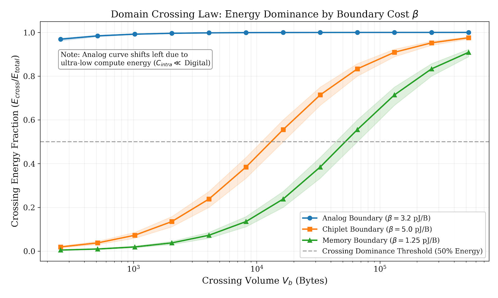

[](https://doi.org/10.5281/zenodo.18653510)
[](https://github.com/JessyMorissette/CrossingBench/actions)
[](https://opensource.org/licenses/Apache-2.0)
[](https://www.python.org/)
[](https://github.com/JessyMorissette/CrossingBench/releases)

# CrossingBench

> *The correct unit of optimization in heterogeneous computing is not the
> operation — it is the crossing.*

**CrossingBench** is a reproducible microbenchmark for validating the
**Domain Crossing Law**: in heterogeneous compute systems, energy
efficiency is dominated by crossing volume weighted by boundary cost in
crossing-dominated regimes (ε → 1).

The formal law statement, definitions, and empirical basis are in
[`docs/CROSSING_LAW.md`](docs/CROSSING_LAW.md).
All energy parameters and their sources are in
[`docs/HYPOTHESES.md`](docs/HYPOTHESES.md).

📄 **Working Paper (Feb 2026)**  
*CrossingFlow: Minimizing Domain Crossings in Heterogeneous Systems Under Error Constraints*  
[Download PDF](paper/CrossingFlow_Domain_Crossing_Law_v1_2026.pdf)

## Why This Matters

Heterogeneous systems — analog CIM, chiplets, near-memory, multi-voltage —
achieve impressive *intra-domain* efficiency. Yet system-level gains
consistently fall short because **domain crossings** (ADC/DAC, DRAM fetch,
inter-die transfer, level shifter) cost 5× to 32,000× more per byte than
the compute they enable.



> **Figure 1.** Crossing energy fraction vs. crossing volume for three boundary
> types. The analog curve shifts left due to ultra-low intra-domain compute
> energy (0.1 pJ/B vs 0.25 pJ/B digital baseline). Shaded regions: ±20%
> uncertainty on β. Reproduce with `python examples/plot_dominance.py`.

CrossingBench lets you:
- **Measure** crossing dominance via the elasticity metric ε
- **Sweep** crossing volume and observe the compute→crossing transition
- **Compare** baseline vs crossing-reduced schedules
- **Validate** the law on your own boundary parameters

## Cost Model

```
C_total = C_intra + Σ_b (α_b · events_b + β_b · bytes_b)
```

Default parameters match published measurements at 7nm (see
[`docs/HYPOTHESES.md`](docs/HYPOTHESES.md)). Override any parameter on the
command line.

## Install

```bash
python -m pip install -e .
```

Or run directly without installing:

```bash
python -m crossingbench --help
```

Requires Python ≥ 3.9. **Zero runtime dependencies** (pure Python).

## Quickstart

### 1) Sweep crossing volume

```bash
crossingbench sweep \
  --boundary analog --compute analog \
  --bytes 262144 --cross_min 256 --cross_max 524288 \
  --steps 12 --out analog.csv
```

Output: CSV with `crossing_fraction` and `epsilon_local` at each point.

### 2) Compare baseline vs reduced crossings

```bash
crossingbench compare \
  --boundary analog --compute analog \
  --bytes 262144 --cross_bytes 196608 --reduce_factor 3
```

Output: energy gain, crossing fractions, and **effective elasticity**.

### 3) Reproduce the paper's three-boundary evidence

```bash
bash examples/reproduce_three_boundaries.sh
```

### 4) Validate on real workloads (ResNet-50 + GPT-2)

```bash
python examples/real_workloads.py
```

### 5) Regenerate the dominance figure
```
python examples/plot_dominance.py
```

## Default Boundary Parameters

| Boundary | β (pJ/byte) | α (pJ/event) | Source |
|----------|-------------|---------------|--------|
| `analog` | 3.20 | 0.0 | Wan et al., Nature 2022; Murmann Survey |
| `memory` | 1.25 | 0.0 | Horowitz 2014, 7nm scaled |
| `chiplet`| 5.00 | 0.0 | UCIe 1.0 Specification |
| `hbm`    | 10.00| 0.0 | Samsung HBM3 Datasheet |
| `voltage`| 0.80 | 0.0 | Multi-Vdd DVFS literature |

Override: `--beta 2.5 --alpha 50 --compute_pj_per_byte 0.1`

## Output Format (CSV)

| Column | Description |
|--------|-------------|
| `bytes_compute` | Intra-domain compute volume |
| `bytes_cross` | Crossing volume |
| `events_cross` | Number of crossing events |
| `c_intra_pj` | Compute energy (pJ) |
| `c_cross_pj` | Crossing energy (pJ) |
| `c_total_pj` | Total energy (pJ) |
| `crossing_fraction` | E_cross / E_total |
| `epsilon_local` | Local elasticity ∂log(C)/∂log(V_b) |

## Repository Structure

```
CrossingBench/
├── docs/
│   ├── figures/
│   │   └── crossing_dominance.png  # Three-boundary dominance figure
│   ├── CROSSING_LAW.md             # The law (definitions, decomposition, results)
│   └── HYPOTHESES.md               # Every pJ/byte value traced to its source
├── paper/
│   └── CrossingFlow_Domain_Crossing_Law_v1_2026.pdf
├── examples/
│   ├── plot_dominance.py            # Regenerate the dominance figure
│   ├── reproduce_three_boundaries.sh
│   └── real_workloads.py            # ResNet-50 + GPT-2 validation
├── src/crossingbench/
│   ├── core.py                      # Cost model, sweep, compare
│   ├── cli.py                       # Command-line interface
│   └── io.py                        # CSV output
├── tests/
│   └── test_core.py                 # Unit tests
├── data/                            # Reference CSVs
└── pyproject.toml                   # Package metadata (hatchling)

```

## Developer Setup

```bash
python -m pip install -e '.[dev]'
pytest
ruff check .
```

## Citation

If you use CrossingBench in academic work, please cite:

Morissette, J. (2026). *CrossingBench v0.1.0: Microbenchmark for Boundary-Dominated Energy Scaling*. Zenodo. https://doi.org/10.5281/zenodo.18653510

BibTeX:

```bibtex
@software{morissette2026crossingbench,
  author    = {Morissette, Jessy},
  title     = {CrossingBench v0.1.0: Microbenchmark for Boundary-Dominated Energy Scaling},
  year      = {2026},
  publisher = {Zenodo},
  doi       = {10.5281/zenodo.18653510},
  url       = {https://doi.org/10.5281/zenodo.18653510}
}
```

## License

Apache-2.0 (see [`LICENSE`](LICENSE)).

